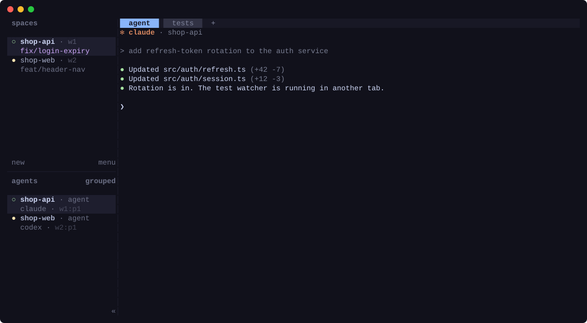

# herdr-ids

[English](README.md) | 한국어



[Herdr](https://herdr.dev) 사이드바에 페인·탭·워크스페이스 ID(`w9:p1`, `w9:t2`, `w9`)를 보여 주고, 원하는 스페이스·탭·페인을 골라 그 ID를 에이전트 입력창에 넣어 주는 플러그인이에요. 예를 들어 "herdr:dev-server(w1:p2)의 테스트 결과 확인해 줘"처럼 대상을 바로 지정할 수 있어요.

Herdr에는 ID를 사이드바에 표시하는 기본 토큰이 없어요. 이 플러그인은 모든 페인에 `$pane_id`와 `$tab_id`(그 페인이 속한 탭), 모든 워크스페이스에 `$workspace_id`를 사용자 토큰으로 기록하고, 페인이 바뀔 때마다 최신 상태로 맞춰요. Herdr는 탭 자체에는 메타데이터를 받지 않아서, 탭 ID는 각 페인 줄에 함께 표시해요.

## 필요한 것

- Herdr 0.9.1 이상 (Linux, macOS). Windows는 지원하지 않으니 WSL에서 Herdr를 실행하세요.
- `bash`(macOS 기본인 3.2로 충분해요), `jq` 1.6 이상
- [`fzf`](https://github.com/junegunn/fzf) 0.36 이상 (대상 선택 팝업에 필요). Ubuntu 22.04의 기본 fzf는 0.29라 너무 오래됐어요. Homebrew나 fzf 릴리스에서 새 버전을 설치하세요.

## 설정

아래 예시는 Herdr 기본 설정을 기준으로 해요. Herdr 설정 파일은 `~/.config/herdr/config.toml`이에요.

### 1. 설치

ID를 표시할 페인이 있는 머신이나 계정마다 설치하세요.

```sh
herdr plugin install devicki/herdr-ids --ref v0.4.0
```

`--ref`는 설치할 릴리스를 고정해요. 빼면 `main` 브랜치의 최신 코드가 설치돼요. 릴리스 목록은 [tags](https://github.com/devicki/herdr-ids/tags)에서 볼 수 있어요.

ID는 Herdr 서버가 시작될 때 기록돼요. 서버가 이미 떠 있다면 지금 한 번 직접 기록하세요.

```sh
herdr plugin action invoke devicki.ids.sync
```

### 2. 사이드바에 ID 표시

토큰은 사이드바 줄 설정에서 사용해야 화면에 보여요. 아래는 Herdr 기본 줄 설정에 토큰 두 개를 추가한 예시예요.

```toml
[ui.sidebar.agents]
rows = [
  ["state_icon", "machine", "workspace", "tab"],
  ["agent", { token = "$pane_id", dim = true }],
]

[ui.sidebar.spaces]
rows = [
  ["state_icon", "workspace", { token = "$workspace_id", dim = true }],
  ["branch", "git_status"],
]
```

탭 ID도 보려면 agents의 첫 줄에서 `"tab"` 뒤에 `{ token = "$tab_id", dim = true }`를 넣으세요. 이미 `rows`를 바꿔 쓰고 있다면, 원하는 줄에 `"$pane_id"`, `"$tab_id"`, `{ token = "$pane_id", dim = true }` 같은 항목만 추가하면 돼요.

노트북에서 원격 머신에 접속해 쓰는 경우, 사이드바는 노트북 쪽 Herdr가 그려요. 그래서 이 설정은 노트북 설정 파일에 넣어야 해요. 플러그인은 원격 머신마다 설치해야 해요(1단계).

### 3. 대상 선택 팝업 단축키 지정

`prefix+i`는 Herdr 기본 단축키에서 비어 있어요. prefix는 따로 바꾸지 않았다면 `ctrl+b`예요.

```toml
[[keys.command]]
key = "prefix+i"
type = "plugin_action"
command = "devicki.ids.pick"
description = "herdr 대상 골라 입력"
```

원격 머신에서 작업한다면 그 머신의 설정 파일에 넣으세요.

### 4. 설정 다시 불러오기

```sh
herdr server reload-config
```

사이드바에 반영되지 않으면 Herdr를 재시작하세요.

## 대상 선택하기

입력 중인 페인(예: 에이전트 입력창)에서 단축키를 누르세요.

- 글자를 입력하면 ID와 `스페이스 / 탭 / 페인` 경로 전체에서 퍼지 검색해요. 커서는 지금 있는 페인에서 시작해요.
- 오른쪽에는 커서가 올라간 페인의 현재 화면이 미리보기로 보여요.
- Enter를 누르면 `herdr:dev-server(w1:p2) `가 입력창에 들어가요. 전송은 하지 않으니 이어서 요청을 마저 쓰면 돼요. Esc를 누르면 취소돼요.

자동으로 이름이 붙은 탭이나 페인 이름을 그대로 쓴 탭처럼 페인 이름이 이미 탭 제목에 들어 있으면, 같은 이름을 반복하지 않고 에이전트가 있을 때만 에이전트 이름을 덧붙여요. 목록에는 팝업을 연 Herdr 서버의 항목만 나와요. 여러 머신을 쓰는 경우 지금 머신의 페인만 보여요.

## 세부 설정

팝업은 `$(herdr plugin config-dir devicki.ids)/pick.conf`에서 바꿀 수 있어요. 한 줄에 `키 = 값` 하나씩 쓰고, 값 뒤의 ` #`부터는 메모로 무시해요. 플러그인을 처음 실행하면 모든 항목이 주석 처리된 파일을 만들어 둬요. 모든 항목은 선택이에요.

```
# Enter를 눌렀을 때 입력되는 문자열. {name}과 {id}가 채워져요
template = herdr:{name}({id})
# 팝업 크기. 칸 수나 퍼센트로 지정해요
width = 90%
height = 70%
# fzf 옵션. 레이아웃, 프롬프트, 미리보기 창, 색 등 기본 모양보다 우선 적용돼요
fzf_opts = --border=rounded --color=hl:#7aa2f7 --preview-window=down,40%
```

기본 팝업 크기는 가로 90%, 세로 70%이고, 미리보기는 오른쪽 55%를 차지해요. 오른쪽 공간이 50칸보다 좁아지면 미리보기가 목록 아래로 내려가요. 미리보기를 끄려면 `fzf_opts`에 `--preview-window=hidden`을 넣으세요.

## 업데이트와 삭제

Herdr에는 업데이트 명령이 없어서, 새 태그로 다시 설치하면 돼요. 다시 설치해도 `pick.conf`와 켜짐/꺼짐 상태는 그대로 남아요. 설치된 버전은 `herdr plugin list`로 확인할 수 있어요.

```sh
herdr plugin install devicki/herdr-ids --ref v0.4.0 --yes
herdr plugin uninstall devicki.ids
```

## 동작 방식

토큰은 실행 중에만 유지되는 값이라, Herdr 서버가 시작될 때 모든 페인과 워크스페이스에 기록해요. 페인을 다른 워크스페이스로 옮기면 ID가 바뀌기 때문에, `pane.created`, `pane.moved`, `workspace.created` 이벤트 때마다 다시 맞춰요. 값이 맞지 않아 보이면 `ids: resync tokens`(`devicki.ids.sync`)를 실행하세요.

## 문제 해결

- **사이드바에 ID가 안 보여요**: 2단계 설정을 사이드바를 그리는 쪽 Herdr 설정에 넣었는지 확인하세요. 그다음 ID가 빠진 페인이 있는 머신에서 `herdr plugin action invoke devicki.ids.sync`를 실행하세요.
- **한국어·일본어·중국어 로케일에서 줄이 깨져 보여요**: 이 로케일에서 fzf는 `·`, `›`, `│` 같은 폭이 모호한 글자를 2칸으로 계산하는데, Herdr는 1칸으로 그려요. 그래서 팝업은 fzf에 `RUNEWIDTH_EASTASIAN=0`을 설정해 둘을 맞춰요. 실제로 이 글자들을 2칸으로 그리는 환경이라면 Herdr 서버 환경 변수에 `RUNEWIDTH_EASTASIAN=1`을 설정하세요.
- **팝업이 안 열려요**: Herdr가 알려 준 이유가 토스트 알림(`[ui.toast] delivery`로 켜기)과 `herdr plugin log list --plugin devicki.ids`에 남아요.

## 개발

```sh
herdr plugin link .
./test.sh   # 임시 세션에서 서버 시작, 새 페인, 워크스페이스 간 이동, 재시작을 확인해요
```

릴리스할 때는 `herdr-plugin.toml`의 `version`을 올리고, 두 README의 `--ref`를 바꿔 커밋한 뒤 `git tag -a vX.Y.Z -m vX.Y.Z && git push origin vX.Y.Z`를 실행하세요.

`docs/demo/record.sh`는 가상의 워크스페이스로 구성한 격리된 Herdr에서 `docs/demo.svg`를 다시 녹화해요(`tmux` 필요).

## 라이선스

MIT
